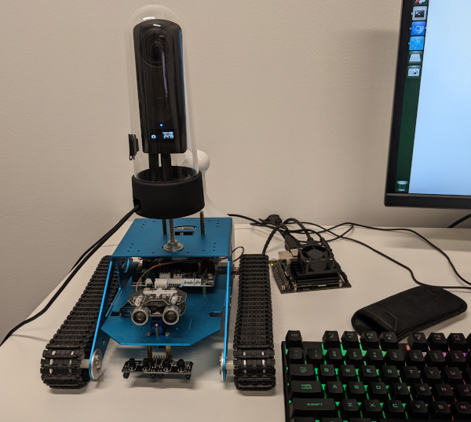

# libptp2 and ptpcam for RICOH THETA camera control with a USB cable

More information is [here](https://theta360.guide/special/linuxstreaming/).

This is based on ptpcam.

[Original project page](http://libptp.sourceforge.net/).

## Modifications

* support for USB 3.0 SuperSpeed USB (SS), though it's not
clear if the THETA Z1 USB3.0 implementation supports this speed - by
[nickel110](https://github.com/nickel110/libptp2)
* support for video file transfer greater than 4GB - by
[nickel110](https://github.com/nickel110/libptp2)
* autoconf version and configuration files updated to
make it easier to modify code on Ubuntu 20.04 and 18.04
* some unused code for non-THETA cameras deleted to make the
code easier to edit
* PTP_VENDOR_THETA added with `0x00000006`, which was previously
assigned to PTP_VENDOR_MICROSOFT
* recovery and retry to wake from sleep - by [nickel110](https://github.com/nickel110/libptp2), [commit](https://github.com/nickel110/libptp2/commit/09a12b61d781f9383cabfaa4557b1b77ea72f647)
* as of October, 2021, `--reset-delay` is deprecated and replaced by the recovery and retry patch from nickel110

## libusb-1.0 library

I like to use libusb-1.0 instead of installing the older libusb-0.1.  In order to compile with libusb-1.0, I use
the [libusb-compat]([libusb-compat-0.1](https://github.com/libusb/libusb-compat-0.1)) package which presents the API for the
older libusb to the current libusb-1.0. Make sure you run `sudo ldconfig` after installing a library. `/usr/local/lib` should
be in your `/etc/ld.so.conf.d/libc.conf` path.  You can confirm this with `cat /etc/ld.so.d/conf/libc.conf`.  If it is not in your library path, add the
line `/usr/local/lib` to the file.

## Installation

On Ubuntu 20.04 x86 and JetPack 4.6 NVIDIA Jetson (Ubuntu 18.04).

```text
$ sudo apt install libusb-dev
$ sudo apt install automake-1.15  # on ubuntu 20.04
or
$ sudo apt install automake   # JetPack 4.6 or Ubuntu 18.04
$ cd theta_libptp2
$ ./configure
$ make
$ sudo make install
$ sudo ldconfig -v 
```

If the build fails, try the following.

```text
$ autoreconf -i
$ ./configure
# if on Ubuntu 22.04 run aclocal prior to automake
$ automake
$ make

# if you don't have a build system installed, you may need some basic 
# tools

$ sudo apt install build-essential
$ sudo apt install libtool
$ sudo apt install automake
...
```

## Test with RICOH THETA

Connect camera to computer with USB cable.  For most commands, the camera needs to be on,
not in sleep mode.

### get camera info

```text
theta --info

THETA Device Info
==================
Model: RICOH THETA Z1
  manufacturer: Ricoh Company, Ltd.
  serial number: '10010104'
  device version: 2.10.3
  extension ID: 0x00000006
  image formats supported: 0x00000005
  extension version: 0x006e
```

### Wake RICOH THETA from sleep

```text
 theta --set-property=0xD80E --val=0x00
```

See [this](https://community.theta360.guide/t/ricoh-theta-api-over-usb-cable-z1-v-s-sc-models/65/127?u=craig) post if you are having problems putting the camera to sleep or waking it up from sleep.

See [this](https://youtu.be/z-mYQY3zYt0) YouTube video on the modifications
and testing.


### Put Camera in Still Image Mode

```text
 theta --set-property=0x5013 --val=0x0001

Camera: RICOH THETA Z1
'Still Capture Mode' is set to: 0x8005 (-32763)
Changing property value to 0x0001 [(null)] succeeded.
```

#### Take Picture

```text
$ theta --capture

Initiating capture...
Object added 0x00000017
Capture completed successfully!
```

#### List Devices

Only one device attached at the moment.   You can use this to get the
device ID of a particular camera.

```text
theta --list-devices

Listing devices...
bus/dev	vendorID/prodID	device model
001/013	0x05CA/0x2716	RICOH THETA Z1
```

#### Put into live streaming mode

```text
theta --set-property=0x5013 --val=0x8005

Camera: RICOH THETA Z1
'Still Capture Mode' is set to: [Normal]
Changing property value to 0x8005 [(null)] succeeded.
``` 

#### Put camera to sleep

```text
theta --set-property=0xd80e --val=0x01

Camera: RICOH THETA Z1
'UNKNOWN' is set to: 0
Changing property value to 0x01 [(null)] succeeded.
```

#### List Files

```text
theta --list-files

Listing files...
Camera: RICOH THETA Z1
Handler:           Size: 	Captured:      	name:
0x00000091:      8028786	2022-11-17 19:19	R0010085.JPG
```

### file transfer of 2.2GB video file with no problem

```text
$ theta --get-all-files
Camera: RICOH THETA Z1
Skipping file: "R0010085.JPG", file exists!
Saving file: "R0010086.MP4" 
is done.
craig@jetpack-4:~/Documents/tmp$ 
craig@jetpack-4:~/Documents/tmp$ ls -l
total 2182384
-rwxr----- 1 craig craig    8028786 Nov 17  2022 R0010085.JPG
-rwxr----- 1 craig craig 2226722795 Nov 17  2022 R0010086.MP4
```

### Delete File

```text
theta --delete-object=0x00000092

Object 0x00000092 (R0010086.MP4) deleted.
craig@jetpack-4:~/Documents/tmp$ theta --list-files

Listing files...
Camera: RICOH THETA Z1
Handler:           Size: 	Captured:      	name:
0x00000091:      8028786	2022-11-17 19:19	R0010085.JPG
```

## Credit

* libptp2 (c)2001-2006 Mariusz Woloszyn <emsi@ipartners.pl>
* ptpcam  (c)2001-2006 Mariusz Woloszyn <emsi@ipartners.pl>

## Action Shot of NVIDIA Jetson with RICOH THETA Z1



TH-3 Case has a port for the USB cable that is connected to a Jetson with Jetpack 4.6

## Compiling with libusb-1.0 using libusb-compat

To compile against libusb-1.0 instead of libusb-0.1, I am using libusb-compat.

* [libusb-compat-0.1](https://github.com/libusb/libusb-compat-0.1)

After installing compatibility layer.

```text
craig@jetpack-4:/usr/local/lib$ ls -l libusb*
lrwxrwxrwx 1 root root     19 Nov 17 10:01 libusb-0.1.so.4 -> libusb-0.1.so.4.4.4
-rwxr-xr-x 1 root root  75896 Nov 17 10:01 libusb-0.1.so.4.4.4
-rw-r--r-- 1 root root 149794 Nov 17 10:01 libusb.a
-rwxr-xr-x 1 root root    941 Nov 17 10:01 libusb.la
lrwxrwxrwx 1 root root     19 Nov 17 10:01 libusb.so -> libusb-0.1.so.4.4.4
```

## Community Discussion

There are many discussions about the USB API on the .guide forum.

For information on a test I did with the NVIDIA Jetson with Jetpack 4.6
and libusb-1.0, see the topic below.  Please ask questions on the forum.

* [NVIDIA Jetson and USB API for RICOH THETA](https://community.theta360.guide/t/nvidia-jetson-and-usb-api-for-ricoh-theta/8566?u=craig)
